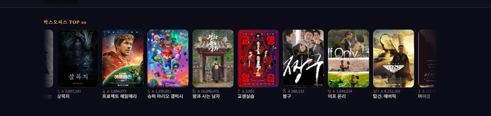
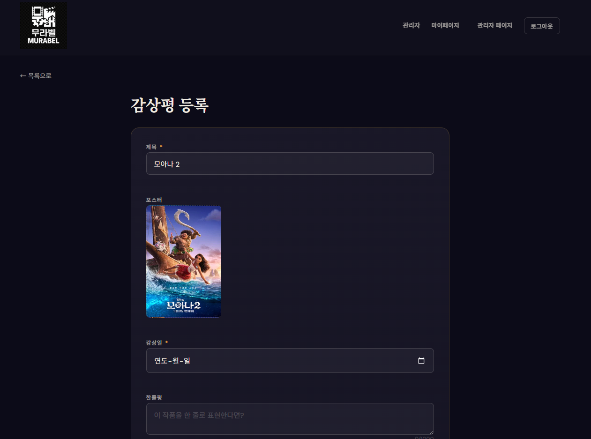
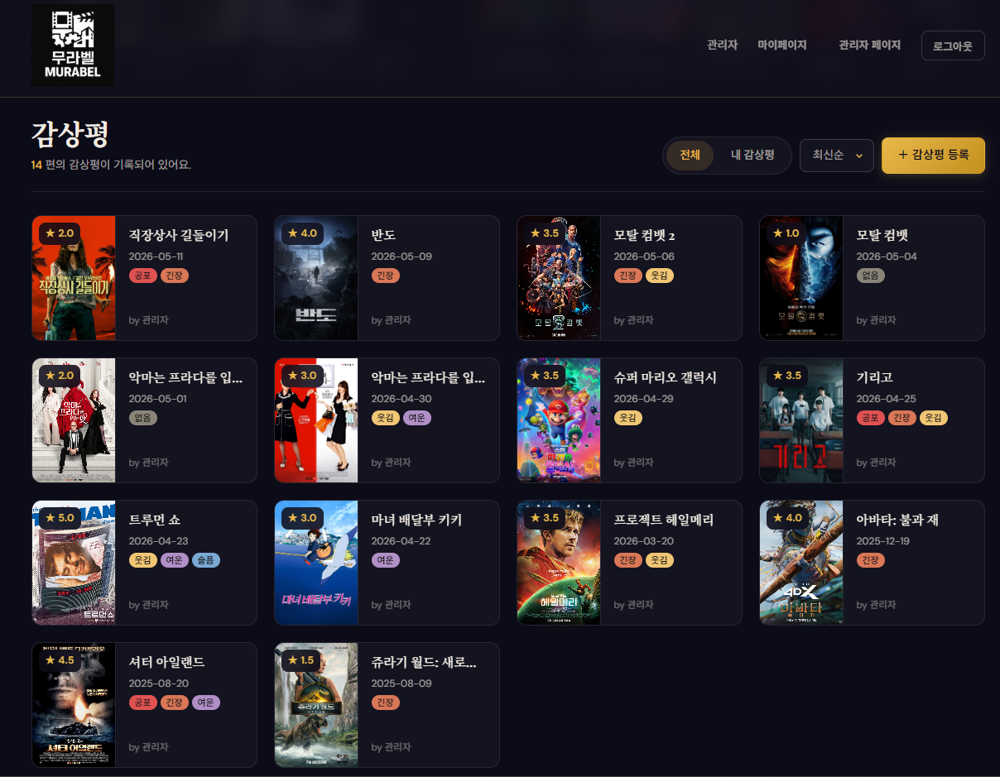
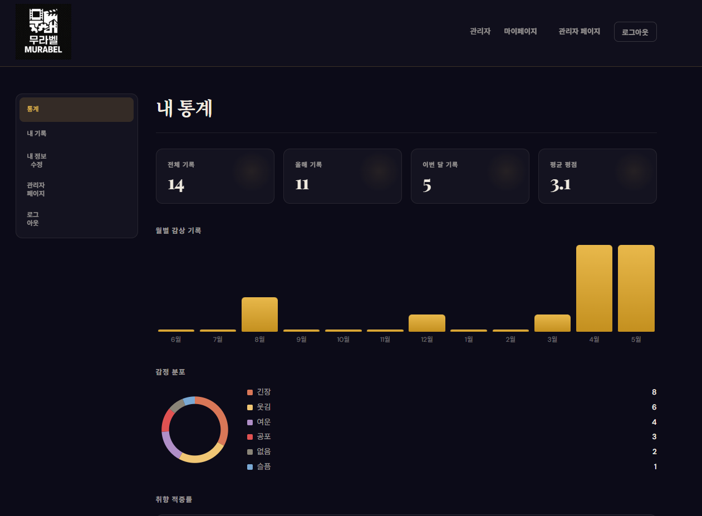
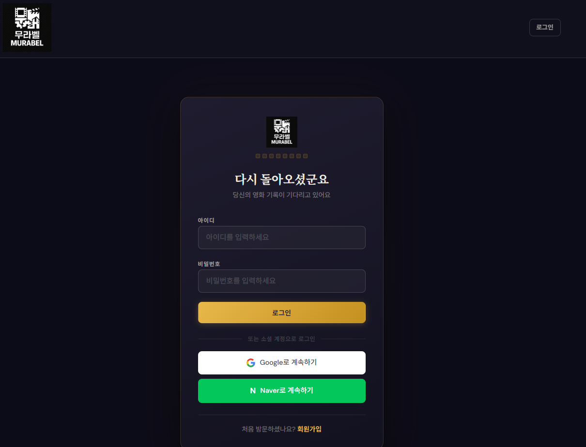
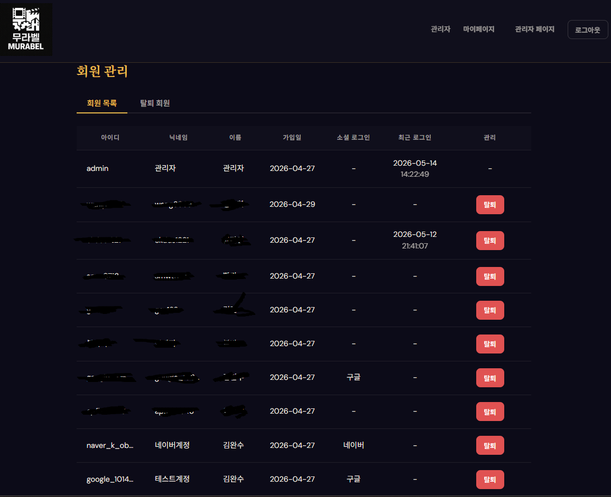

# MovieRecord

영화·TV 시리즈 감상 기록 웹 서비스. TMDB·KOBIS·OMDb 세 API를 연동해 홈 화면을 구성하고, 통합 검색으로 작품을 찾아 별점·감정·몰입감·스토리·취향 일치도를 기록합니다. 마이페이지에서 감상 통계를 확인할 수 있습니다.

> 개인 프로젝트 | Java 21 / Spring Boot

---

## 목차

1. [기술 스택](#기술-스택)
2. [주요 기능](#주요-기능)
3. [회원기능 및 외부 API 연동](#회원기능-및-외부-API-연동)
4. [패키지 구조](#패키지-구조)
5. [서버 아키텍처](#서버-아키텍처)
6. [로컬 실행](#로컬-실행)
7. [캐시 전략](#캐시-전략)

---

## 기술 스택


| 분류 | 기술 | 선택 이유 |
|------|------|---------|
| Language | Java 21 | Record, 패턴 매칭 등 최신 문법으로 DTO·분기 처리를 간결하게 표현 |
| Framework | Spring Boot 4.0.5 | 의존성 관리와 자동 설정으로 인프라보다 도메인 로직에 집중 |
| ORM | Spring Data JPA / Hibernate | 객체 중심 모델링, JPA Auditing으로 생성·수정 시각 자동 관리 |
| Security | Spring Security | 폼 로그인과 OAuth2를 동일한 필터 체인에서 통합 관리 |
| View | Thymeleaf | 서버 사이드 렌더링, 별도 API 서버 없이 빠른 기능 구현 |
| DB | H2 (로컬) / MySQL 8.4 (운영) | 로컬에서 DB 설치 없이 개발, 운영은 MySQL로 전환 |
| Cache | Redis (운영) / Spring Cache | TTL 기반 캐싱으로 응답 속도 개선 및 반복 연산 비용 절감 |
| Infra | Docker + Nginx | 컨테이너 단위 배포, 리버스 프록시로 정적 파일·앱 서버 분리 |

---

## 주요 기능

### 스포트라이트

매일 TMDB discover 결과에서 무작위로 영화를 고른 뒤 OMDb API로 IMDb·Rotten Tomatoes·Metacritic 점수를 검증해 품질 기준을 통과한 영화 3편을 홈 히어로 섹션에 표시합니다. 자정에 스케줄러가 캐시를 사전 워밍하고, 첫 번째 픽은 DB에 이력을 기록합니다.

> 품질 기준: IMDb > 7.5 **또는** Rotten Tomatoes > 60% **또는** Metacritic > 75

---

### 박스오피스 TOP 10

KOBIS 오픈API로 전날 일별 TOP 10을 조회하고, TMDB 영화 검색 API로 포스터 이미지를 매칭해 Swiper 캐러셀 카드로 표시합니다.
 
> 

---

### 통합 검색

TMDB 멀티 검색 엔드포인트로 영화·TV·인물을 한 번에 검색합니다. 결과 카드에 미디어 타입 배지를 표시하고, 클릭하면 해당 상세 페이지로 이동합니다.

---

### 작품·인물 상세 페이지

영화(`/movie/{id}`), TV(`/tv/{id}`), 인물(`/person/{id}`) 각각의 상세 페이지를 제공합니다. 작품 페이지에서는 TMDB 기본 정보 위에 OMDb에서 가져온 IMDb·RT·Metacritic 배지를 함께 표시하고, 사용자들이 남긴 murabel 평균 별점도 확인할 수 있습니다.

---

### 감상 기록

TMDB 멀티 검색(영화·TV)으로 작품을 선택한 뒤 별점, 한줄평, 몰입감, 스토리, 감정, 취향 일치도를 기록합니다. 기록 목록과 상세 화면에서 작성한 내용을 확인할 수 있습니다.
 
> 
> 

---

### 마이페이지 통계

총 기록 수, 연간·월간 기록 수, 평균 별점, 취향 일치율을 집계합니다. 최근 12개월 월별 기록 수 그래프와 감정 분포 차트를 함께 제공합니다.

> 

---

### 인증

폼 로그인과 OAuth2 소셜 로그인을 지원합니다. 신규 가입 계정은 관리자 승인(PENDING → ACTIVE) 후 서비스를 이용할 수 있습니다.
 
> 

---

### 관리자 회원 관리

가입 대기(PENDING) 회원 승인, 활성 회원 강제 탈퇴, 탈퇴 회원 복구 기능을 제공합니다. 강제 탈퇴 시 해당 사용자의 활성 세션을 즉시 만료시킵니다.

> 

---

## 회원기능 및 외부 API 연동

### 1. Spring Security — 폼 로그인과 OAuth2 이중 인증 체계

**설계 목표**

폼 로그인 전용 계정과 소셜 로그인 전용 계정을 하나의 `users` 테이블에서 관리하면서, 계정 상태(PENDING / ACTIVE / WITHDRAWN)에 따른 접근 제어를 두 인증 경로 모두에 일관되게 적용합니다.

**상태 흐름**

```
회원가입 → PENDING
              ↓ 관리자 승인
           ACTIVE ←── 복구
              ↓ 탈퇴
          WITHDRAWN
```

**폼 로그인 경로**

`UserService`가 `UserDetailsService`를 구현합니다. `loadUserByUsername()`에서 계정 상태에 따라 Spring Security 표준 예외를 던집니다.

- `PENDING` → `DisabledException` → 로그인 실패 핸들러가 `/auth/login?disabled`로 리다이렉트
- `WITHDRAWN` → `LockedException` → `/auth/login?withdrawn`으로 리다이렉트
- OAuth2 전용 계정(`provider != null`) → `UsernameNotFoundException`으로 폼 로그인 자체를 차단. 비밀번호 필드에는 `{noop}OAUTH_ACCOUNT_NO_PASSWORD` 센티넬 값을 저장해 실수로 인증이 통과되지 않도록 이중 방어

**OAuth2 경로**

`CustomOAuth2UserService`가 `OAuth2UserService`를 구현합니다. `loadUser()`에서 소셜 사용자를 DB에 등록하거나 조회한 뒤, 상태가 PENDING·WITHDRAWN이면 커스텀 `errorCode`를 담은 `OAuth2AuthenticationException`을 던집니다.

```java
// CustomOAuth2UserService.loadUser()
if (user.getStatus() == UserStatus.PENDING) {
    throw new OAuth2AuthenticationException(
        new OAuth2Error("account_pending", "Account is awaiting admin approval", null));
}
```

`OAuth2LoginFailureHandler`는 `errorCode`를 Java 21 switch expression으로 분기해 동일한 로그인 페이지 파라미터로 연결합니다.

```java
url = switch (oae.getError().getErrorCode()) {
    case "account_pending"  -> "/auth/login?disabled";
    case "account_withdrawn" -> "/auth/login?withdrawn";
    default                 -> "/auth/login?error";
};
```

**핸들러 분리**

성공·실패 후처리 로직을 `LoginSuccessHandler`, `LoginFailureHandler`, `OAuth2LoginFailureHandler` 세 클래스로 분리하고 `SecurityConfig`에 주입했습니다. `SecurityConfig`가 핸들러의 구현 방식을 몰라도 되도록 인터페이스 타입(`AuthenticationSuccessHandler`, `AuthenticationFailureHandler`)으로 의존합니다.

**결과**

폼 로그인·소셜 로그인 어느 경로로 시도해도 PENDING·WITHDRAWN 계정은 동일한 안내 메시지 화면으로 리다이렉트됩니다.

---

### 2. 외부 API 연동 — OMDb 다중 평점 배지

**설계 목표**

영화·TV 상세 페이지에서 IMDb, Rotten Tomatoes, Metacritic 세 기관의 평점을 배지 형태로 함께 표시합니다.

**OMDb 연동**

Spring 6의 `RestClient`를 `@Qualifier("omdbRestClient")`로 등록하고 `OmdbClient`에 주입했습니다. `imdbId`를 파라미터로 넘기면 `Ratings` 배열을 파싱해 출처별로 CSS 클래스를 계산해 반환합니다.

```java
// OmdbClient.java — 소스 정규화 및 배지 클래스 계산
private static String normalizeSource(String source) {
    return switch (source) {
        case "Internet Movie Database" -> "IMDb";
        default -> source;
    };
}

private static String computeCssClass(String source, String value) {
    return switch (source) {
        case "Rotten Tomatoes" -> {
            int score = Integer.parseInt(value.replace("%", "").trim());
            yield score >= 60 ? "rating-rt-fresh" : "rating-rt-rotten";
        }
        case "Metacritic" -> {
            int score = Integer.parseInt(value.split("/")[0].trim());
            if (score >= 75) yield "rating-mc-green";
            else if (score >= 50) yield "rating-mc-yellow";
            else yield "rating-mc-red";
        }
        default -> "rating-imdb";
    };
}
```

작품 상세 페이지에서는 TMDB 평점을 첫 번째 항목으로 합성한 뒤 OMDb 결과를 이어 붙입니다. 어느 API가 실패해도 나머지 배지는 정상 표시됩니다.

**스포트라이트 품질 필터**

`SpotlightService`에서도 OMDb 평점을 사용합니다. 랜덤으로 선택한 영화가 IMDb > 7.5, RT > 60%, Metacritic > 75 중 하나를 충족하지 못하면 다시 픽합니다. 최대 10회 재시도하며, 모두 실패하면 전날 기록을 폴백으로 사용합니다.

---

### 3. 외부 API 연동 — KOBIS 박스오피스 + TMDB 포스터 합성

**설계 목표**

KOBIS API로 박스오피스 순위를 가져오고, TMDB API로 포스터 이미지를 보완해 하나의 카드 UI로 완성합니다.

**KOBIS 연동**

공식 SDK(`KobisOpenAPIRestService`)는 생성자에 API 키를 직접 받는 구조입니다. 매 요청마다 인스턴스를 생성하는 대신 `@Bean`으로 등록해 Spring DI로 주입받도록 구성했습니다. API 키는 `@ConfigurationProperties`로 바인딩된 `KobisProperties`에서 한 곳에서 관리됩니다.

```java
// KobisConfig.java
@Bean
public KobisOpenAPIRestService kobisOpenAPIRestService(KobisProperties kobisProperties) {
    return new KobisOpenAPIRestService(kobisProperties.key());
}
```

**TMDB 연동**

Spring 6의 `RestClient`를 `@Qualifier("tmdbRestClient")`로 등록하고 `TmdbClient`에 주입했습니다. 박스오피스 제목 매칭 정확도를 높이기 위해 멀티 검색(`/search/multi`)과 영화 전용 검색(`/search/movie`) 엔드포인트를 분리해 상황에 따라 선택적으로 호출합니다. 모든 응답은 `language=ko-KR`로 한국어를 기본값으로 지정했습니다.

**포스터 합성**

KOBIS 응답의 영화 제목을 키로 TMDB 영화 전용 검색을 수행하고, 결과의 `poster_path`를 박스오피스 카드에 합산합니다. 초기에 멀티 검색만 사용했을 때 TV 시리즈 결과가 섞여 포스터가 잘못 매칭되는 문제가 있었습니다. 영화 전용 검색 엔드포인트를 분리해 적용한 뒤 정확도가 개선됐습니다.

---

## 패키지 구조

도메인 중심으로 패키지를 구성했습니다. 새 도메인은 최상위에 패키지를 추가하는 방식으로 확장합니다.

```
com.my.movierecord
├── admin/       관리자 — 회원 승인·탈퇴·복구, 세션 강제 만료
├── auth/        인증·인가 (domain, handler, oauth, repository, service)
├── common/      홈 컨트롤러·예외 처리·파일 저장 서비스
├── config/      Security, JPA, Web, 스케줄링, Cache 설정
├── content/     영화·TV 상세 페이지 컨트롤러
├── kobis/       KOBIS 박스오피스 API 연동 (config, dto, service)
├── movie/       로컬 콘텐츠 레지스트리 — Content 엔티티 (domain, repository, service)
├── mypage/      마이페이지 통계 컨트롤러
├── omdb/        OMDb 평점 API 클라이언트 (client, config, dto)
├── person/      인물 상세 페이지 컨트롤러
├── record/      감상 기록 CRUD + 통계 계산 (stats/)
├── search/      TMDB 통합 검색 컨트롤러
├── spotlight/   일별 스포트라이트 (domain, dto, repository, scheduler, service)
└── tmdb/        TMDB API 클라이언트 (client, config, dto, service)
```

---

## 서버 아키텍처

AWS EC2 위에서 Docker Compose로 Nginx · Spring Boot · MySQL 세 컨테이너를 운영합니다.

```
          Internet
             │
    HTTP :80 / HTTPS :443
             │
             ▼
 ┌─────────────────────────────────────────┐
 │  AWS EC2                                │
 │  ┌───────────────────────────────────┐  │
 │  │  Docker Compose Network           │  │
 │  │                                   │  │
 │  │  ┌─────────────┐                  │  │
 │  │  │    Nginx    │  /uploads/ →     │  │
 │  │  │  :80 / :443 │  볼륨 직접 서빙    │  │
 │  │  └──────┬──────┘                  │  │
 │  │         │ proxy_pass              │  │
 │  │         │ http://app:8080         │  │
 │  │         ▼                         │  │
 │  │  ┌──────────────┐   ┌───────────┐ │  │
 │  │  │ Spring Boot  │─▶│  uploads/ │ │  │
 │  │  │   (expose)   │   │  (volume) │ │  │
 │  │  │    :8080     │   └───────────┘ │  │
 │  │  └──────┬───────┘                 │  │
 │  │         │ JDBC / Redis            │  │
 │  │    ┌────┴────┐                    │  │
 │  │    │         │                    │  │
 │  │    ▼         ▼                    │  │
 │  │  ┌──────────┐ ┌──────────────┐    │  │
 │  │  │ MySQL8.4 │ │    Redis     │    │  │
 │  │  │127.0.0.1 │ │  127.0.0.1   │    │  │
 │  │  │  :3306   │ │   :6379      │    │  │
 │  │  └──────────┘ └──────────────┘    │  │
 │  └───────────────────────────────────┘  │
 └─────────────────────────────────────────┘
```

### 구성 요소

| 컴포넌트 | 역할 |
|---------|------|
| AWS EC2 | 단일 인스턴스에서 전체 스택 운영 |
| Nginx | HTTP → HTTPS 리다이렉트, SSL 종단, 리버스 프록시, 정적 파일 서빙 |
| Spring Boot | 애플리케이션 서버 (외부 포트 미노출, Docker 내부 통신만) |
| MySQL 8.4 | 운영 DB (127.0.0.1 바인딩으로 호스트 외부 접근 차단) |
| Redis | Spring Cache 백엔드, 박스오피스 캐시 저장 (127.0.0.1 바인딩) |
| Let's Encrypt | Certbot으로 SSL 인증서 발급·갱신 |

### 핵심 설계 포인트

**HTTPS 강제 + SSL 종단**

Nginx가 80포트의 모든 요청을 443으로 301 리다이렉트하고, Let's Encrypt 인증서로 SSL을 종단합니다. Spring Boot는 `server.forward-headers-strategy=framework`로 `X-Forwarded-Proto` 헤더를 신뢰해 앱 레벨에서도 HTTPS 요청으로 인식합니다.

```nginx
# HTTP → HTTPS 리다이렉트
location / {
    return 301 https://$host$request_uri;
}
```

**정적 파일 직접 서빙**

업로드 이미지(`/uploads/`)는 Spring Boot를 거치지 않고 Nginx가 볼륨을 공유해 직접 응답합니다. 불필요한 WAS 부하를 줄이고 `expires 30d`로 브라우저 캐싱을 적용합니다.

```nginx
location /uploads/ {
    alias /app/uploads/;
    expires 30d;
}
```

**컨테이너 시작 순서 보장**

`depends_on` + `healthcheck`로 MySQL이 완전히 기동한 뒤에만 Spring Boot 컨테이너가 시작됩니다. `mysqladmin ping`을 10초 간격·최대 10회 재시도해 초기화 중 연결 실패를 방지합니다.

**멀티스테이지 Dockerfile**

`eclipse-temurin:21-jdk`로 빌드하고, 최종 이미지는 `eclipse-temurin:21-jre`만 포함합니다. JDK·소스코드·Gradle 캐시가 배포 이미지에 포함되지 않아 이미지 크기를 줄입니다.

```dockerfile
FROM eclipse-temurin:21-jdk AS builder
RUN ./gradlew clean bootJar -x test

FROM eclipse-temurin:21-jre   # 런타임 이미지만 배포
COPY --from=builder /app/build/libs/*.jar app.jar
```

---

## 로컬 실행

### 1. 환경 변수 설정

`src/main/resources/application-local.properties`에 작성하거나 환경 변수로 설정합니다.

```properties
TMDB_API_TOKEN=Bearer eyJ...
KOBIS_API_KEY=your_key
OMDB_API_KEY=your_key
```

### 2. 실행

```bash
./gradlew bootRun   # local 프로파일 자동 적용, H2 인메모리 DB 사용
```

| 항목 | 값 |
|------|---|
| H2 콘솔 | http://localhost:8080/h2-console |
| JDBC URL | `jdbc:h2:file:./data/movierecord;AUTO_SERVER=TRUE` |
| 사용자 | `sa` |
| 비밀번호 | (없음) |

### 운영 배포

`.env` 파일에 환경 변수를 작성한 뒤 실행합니다. Nginx가 80 포트를 받아 앱 서버로 프록시합니다.

```bash
docker compose up -d
```

---

## 캐시 전략

### Spring Cache + Redis (운영 전용)

Spring Cache 추상화 위에 Redis를 백엔드로 사용합니다. `@Cacheable` 어노테이션만으로 캐시를 적용할 수 있어 도메인별로 점진적으로 확장합니다.

**TTL 설정**

캐시 이름별로 TTL을 개별 지정하고, 별도 설정이 없는 캐시는 기본 TTL을 따릅니다.

| 캐시 이름 | 대상 | 키 | TTL |
|----------|------|-----|-----|
| `todaySpotlight` | 홈 스포트라이트 3편 | `LocalDate.now()` | 1일 (자정 스케줄러가 사전 워밍) |
| `dailyBoxOffice` | KOBIS 일별 박스오피스 TOP 10 | `LocalDate.now().minusDays(1)` | 1일 |
| 기본 | TMDB 홈 섹션(현재 상영·개봉 예정 등) | 메서드별 | 1시간 |

**스포트라이트 사전 워밍**

`SpotlightScheduler`가 매일 자정(`cron = "0 0 0 * * *"`)에 `SpotlightService.getTodaySpotlights()`를 호출합니다. 캐시 키가 `LocalDate` 기반이므로 자정 이후 첫 요청에서 cache miss → 신규 픽이 일어나기 전에 스케줄러가 미리 채워 둡니다.

**직렬화**

`GenericJacksonJsonRedisSerializer`로 값을 순수 JSON으로 저장합니다. `enableDefaultTyping`을 사용하지 않아 JSON에 `@class` 타입 정보를 포함하지 않습니다. 클래스 경로가 바뀌어도 기존 캐시 데이터를 역직렬화할 수 있습니다.

**로컬 환경**

`local` 프로파일에서는 `RedisCacheManager` 빈이 등록되지 않고 Spring의 기본 `ConcurrentMapCacheManager`가 사용됩니다. Redis 없이 로컬 개발이 가능합니다.
