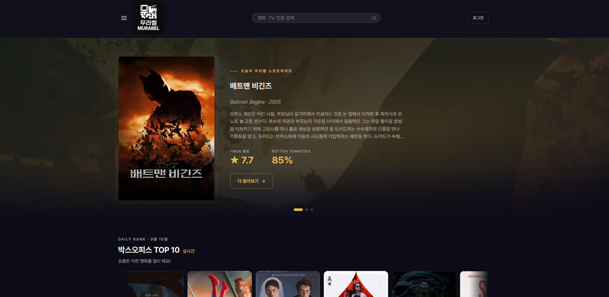

# MovieRecord


영화·TV 시리즈 감상 기록 웹 서비스. TMDB·KOBIS·OMDb 세 API를 연동해 홈 화면을 구성하고, 통합 검색으로 작품을 찾아 별점·감정·몰입감·스토리·취향 일치도를 기록합니다. 마이페이지에서 감상 통계를 확인할 수 있습니다.

> 개인 프로젝트 | Java 21 / Spring Boot | **서비스: [mu-ra-bel.com](https://mu-ra-bel.com)**
> 데모 계정: `demo` / `demo`




### 핵심 설계 결정

- **세션 없는 인증**: JWT 액세스 토큰 + 서버 보관 리프레시 토큰. 리프레시 토큰은 SHA-256 해시로 DB에 두고 회전·재사용 탐지로 탈취에 대응하며, 동시 회전 요청은 조건부 UPDATE 하나로 하나만 통과시킵니다. → [토큰 기반 stateless 인증](#2-토큰-기반-stateless-인증--jwt-액세스-토큰--서버-보관-리프레시-토큰)
- **화면 중요도에 따른 장애 격리**: 외부 API 3종을 Resilience4j로 감싸되, 핵심 콘텐츠는 503으로 명확히 실패시키고 부가 영역은 빈 결과를 반환해 화면은 그대로 렌더링합니다. → [장애 격리](#장애-격리)
- **관측 데이터를 서버 외부로 분리**: 같은 인스턴스에 있던 Prometheus·Grafana를 걷어내고 CloudWatch로 지표·로그·알람을 분리했습니다. 서버가 죽어도 마지막 상태가 남습니다. → [모니터링](#모니터링)
- **포스터 이미지를 CDN에서 직접 서빙**: 디스크 캐싱을 제거하고 TMDB 경로만 저장해 브라우저가 CDN에서 직접 받도록 바꿨습니다. 인스턴스 교체 시 캐시 유실과 이미지 트래픽 부담이 사라졌습니다. → [이미지 서빙](#핵심-설계-포인트)

---

## 목차

1. [기술 스택](#기술-스택)
2. [주요 기능](#주요-기능)
3. [회원기능 및 외부 API 연동](#회원기능-및-외부-api-연동)
4. [패키지 구조](#패키지-구조)
5. [장애 격리](#장애-격리)
6. [서버 아키텍처](#서버-아키텍처)
7. [모니터링](#모니터링)
8. [트러블슈팅](#트러블슈팅)
9. [테스트](#테스트)
10. [로컬 실행](#로컬-실행)
11. [캐시 전략](#캐시-전략)

---

## 기술 스택


| 분류 | 기술 | 선택 이유 |
|------|------|---------|
| Language | Java 21 | Record, 패턴 매칭 등 최신 문법으로 DTO·분기 처리를 간결하게 표현 |
| Framework | Spring Boot 4.0.5 | 의존성 관리와 자동 설정으로 인프라보다 도메인 로직에 집중 |
| ORM | Spring Data JPA / Hibernate | 객체 중심 모델링, JPA Auditing으로 생성·수정 시각 자동 관리 |
| Security | Spring Security + JWT (jjwt) | 폼 로그인과 OAuth2를 동일한 필터 체인에서 통합 관리. 세션 없는 stateless 인증, 리프레시 토큰은 DB 원장 + Redis 캐시 |
| View | Thymeleaf | 서버 사이드 렌더링, 별도 API 서버 없이 빠른 기능 구현 |
| DB | H2 (로컬) / MySQL 8.4 (운영) | 로컬에서 DB 설치 없이 개발, 운영은 MySQL로 전환 |
| Cache | Redis (운영) / Spring Cache | TTL 기반 캐싱으로 응답 속도 개선 및 반복 연산 비용 절감 |
| Infra | AWS EC2 (t4g.small / ARM64) + Docker + Nginx | 컨테이너 단위 배포, 리버스 프록시로 SSL 종단과 앱 서버 분리 |
| Resilience | Resilience4j | 외부 API 3종 장애가 전체 서비스로 전파되지 않도록 격리·차단 |
| Observability | AWS CloudWatch + Actuator | 관측 데이터를 인스턴스 외부에 적재해 서버가 죽어도 마지막 상태가 남도록 구성 |

---

## 주요 기능

### 스포트라이트

매일 TMDB discover 결과에서 무작위로 영화를 고른 뒤 OMDb API로 IMDb·Rotten Tomatoes·Metacritic 점수를 검증해 품질 기준을 통과한 영화 3편을 홈 히어로 섹션에 표시합니다. 기준에 못 미치면 다시 픽하며 최대 10회 재시도하고, 모두 실패하면 전날 기록을 폴백으로 사용합니다. 자정에 스케줄러가 캐시를 사전 워밍하고, 첫 번째 픽은 DB에 이력을 기록합니다.

> 품질 기준: IMDb > 7.5 **또는** Rotten Tomatoes > 60% **또는** Metacritic > 75

---

### 박스오피스 TOP 10

KOBIS 오픈API로 전날 일별 TOP 10을 조회하고, TMDB 영화 검색 API로 포스터 이미지를 매칭해 Swiper 캐러셀 카드로 표시합니다.

> 

---

### 통합 검색

TMDB 멀티 검색 엔드포인트로 영화·TV·인물을 한 번에 검색합니다. 결과 카드에 미디어 타입 배지를 표시하고, 클릭하면 해당 상세 페이지로 이동합니다.

---

### 작품·인물 상세 페이지

영화(`/movie/{id}`), TV(`/tv/{id}`), 인물(`/person/{id}`) 각각의 상세 페이지를 제공합니다. 작품 페이지에서는 TMDB 기본 정보 위에 OMDb에서 가져온 IMDb·RT·Metacritic 배지를 함께 표시하고, 사용자들이 남긴 murabel 평균 별점도 확인할 수 있습니다.

---

### 감상 기록

TMDB 멀티 검색(영화·TV)으로 작품을 선택한 뒤 별점, 한줄평, 몰입감, 스토리, 감정, 취향 일치도를 기록합니다. 기록 목록과 상세 화면에서 작성한 내용을 확인할 수 있습니다.

> 
> 

---

### 마이페이지 통계

총 기록 수, 연간·월간 기록 수, 평균 별점, 취향 일치율을 집계합니다. 최근 12개월 월별 기록 수 그래프와 감정 분포 차트를 함께 제공합니다.

> 

---

### 인증

폼 로그인과 OAuth2 소셜 로그인(Google, Naver)을 지원합니다. 어느 경로로 로그인해도 JWT 액세스 토큰과 리프레시 토큰을 httpOnly 쿠키로 발급하며, 서버는 세션을 만들지 않습니다. 신규 가입 계정은 관리자 승인(PENDING → ACTIVE) 후 서비스를 이용할 수 있습니다.

> 

---

### 관리자 회원 관리

가입 대기(PENDING) 회원 승인, 활성 회원 강제 탈퇴, 탈퇴 회원 복구 기능을 제공합니다. 강제 탈퇴 시 해당 사용자의 리프레시 토큰을 모두 폐기해 토큰 재발급을 차단합니다.

> 

---

## 회원기능 및 외부 API 연동

### 1. Spring Security — 폼 로그인과 OAuth2 이중 인증 체계

**설계 목표**

폼 로그인 전용 계정과 소셜 로그인 전용 계정을 하나의 `users` 테이블에서 관리하면서, 계정 상태(PENDING / ACTIVE / WITHDRAWN)에 따른 접근 제어를 두 인증 경로 모두에 일관되게 적용합니다.

**상태 흐름**

```
회원가입 → PENDING
              ↓ 관리자 승인
           ACTIVE ←── 복구
              ↓ 탈퇴
          WITHDRAWN
```

**폼 로그인 경로**

`UserService`가 `UserDetailsService`를 구현합니다. `loadUserByUsername()`에서 계정 상태에 따라 Spring Security 표준 예외를 던집니다.

- `PENDING` → `DisabledException` → 로그인 실패 핸들러가 `/auth/login?disabled`로 리다이렉트
- `WITHDRAWN` → `LockedException` → `/auth/login?withdrawn`으로 리다이렉트
- OAuth2 전용 계정(`provider != null`) → `UsernameNotFoundException`으로 폼 로그인 자체를 차단. 비밀번호 필드에는 `{noop}OAUTH_ACCOUNT_NO_PASSWORD` 센티넬 값을 저장해 실수로 인증이 통과되지 않도록 이중 방어

**OAuth2 경로**

`CustomOAuth2UserService`가 `OAuth2UserService`를 구현합니다. `loadUser()`에서 소셜 사용자를 DB에 등록하거나 조회한 뒤, 상태가 PENDING·WITHDRAWN이면 커스텀 `errorCode`를 담은 `OAuth2AuthenticationException`을 던집니다.

```java
// CustomOAuth2UserService.loadUser()
if (user.getStatus() == UserStatus.PENDING) {
    throw new OAuth2AuthenticationException(
        new OAuth2Error("account_pending", "Account is awaiting admin approval", null));
}
```

`OAuth2LoginFailureHandler`는 `errorCode`를 Java 21 switch expression으로 분기해 동일한 로그인 페이지 파라미터로 연결합니다.

```java
url = switch (oae.getError().getErrorCode()) {
    case "account_pending"  -> "/auth/login?disabled";
    case "account_withdrawn" -> "/auth/login?withdrawn";
    default                 -> "/auth/login?error";
};
```

**핸들러 분리**

성공·실패 후처리 로직을 `LoginSuccessHandler`, `OAuth2LoginSuccessHandler`, `LoginFailureHandler`, `OAuth2LoginFailureHandler` 네 클래스로 분리하고 `SecurityConfig`에 주입했습니다. 두 성공 핸들러는 동일하게 토큰 쌍을 발급해 쿠키로 내려주고, `SecurityConfig`가 핸들러의 구현 방식을 몰라도 되도록 인터페이스 타입(`AuthenticationSuccessHandler`, `AuthenticationFailureHandler`)으로 의존합니다.

**결과**

폼 로그인·소셜 로그인 어느 경로로 시도해도 PENDING·WITHDRAWN 계정은 동일한 안내 메시지 화면으로 리다이렉트됩니다.

---

### 2. 토큰 기반 stateless 인증 — JWT 액세스 토큰 + 서버 보관 리프레시 토큰

**설계 목표**

HTTP 세션 없이 인증 상태를 유지합니다. 서버가 세션을 들고 있지 않으므로 인스턴스를 교체하거나 재시작해도 로그인이 유지되고, 컨테이너 메모리에 세션 저장소가 필요 없습니다. 대신 "서버가 로그아웃을 강제할 수 없다"는 stateless JWT의 약점을 서버 보관 리프레시 토큰 원장으로 보완합니다.

**토큰 구조**

| 토큰 | 형식 | 보관 | TTL |
|------|------|------|-----|
| 액세스 토큰 | JWT (HS256) | httpOnly 쿠키 `ACCESS_TOKEN`, `Path=/` | 15분 |
| 리프레시 토큰 | 32바이트 난수 | httpOnly 쿠키 `REFRESH_TOKEN`, `Path=/auth` + DB(SHA-256 해시) | 14일 |

`JwtAuthenticationFilter`가 매 요청 `ACCESS_TOKEN` 쿠키를 검증해 SecurityContext를 재구성합니다(`SessionCreationPolicy.STATELESS`). 두 쿠키 모두 `HttpOnly`, `SameSite=Lax`이고 운영에서는 `Secure`를 강제합니다. 리프레시 쿠키는 `Path=/auth`로 스코프를 좁혀 토큰 재발급·로그아웃 요청에만 전송됩니다. 서명 시크릿은 환경 변수로만 주입하며, 누락되거나 32바이트 미만이면 기동 시 fail-fast 합니다.

**리프레시 토큰 원장과 Redis 캐시**

리프레시 토큰은 원문을 저장하지 않고 SHA-256 해시만 `refresh_tokens` 테이블에 보관합니다. DB가 유출돼도 원문을 복원할 수 없습니다. Redis에는 해시 → userId 조회 캐시를 write-through로 함께 기록하되, DB가 유일한 원장(source of truth)이고 Redis는 best-effort입니다.

Redis 접근은 별도 서킷브레이커(`refreshTokenCache`)로 감쌌습니다. 외부 API용 기본 설정은 HTTP 예외만 집계하므로 이 인스턴스는 `record-exceptions`를 재정의해 Redis 장애가 집계되도록 했고, Redis 호출은 외부 API보다 훨씬 빨라야 하므로 open-state 대기를 5초로 짧게 잡았습니다. 서킷이 열리거나 Redis가 죽으면 `TokenService`가 예외를 삼키고 DB 원장으로 폴백해 로그인 유지에는 영향이 없습니다.

```java
// TokenService — Redis 캐시는 best-effort, 실패 시 DB 원장으로 폴백
private Optional<Long> lookupCache(String hash) {
    try {
        return cacheService.findUserId(hash);
    } catch (Exception e) {
        log.warn("Redis 리프레시 캐시 조회 실패 → DB 폴백: {}", e.toString());
        return Optional.empty();
    }
}
```

**회전(rotation)과 재사용 탐지**

`POST /auth/token/refresh`는 리프레시 토큰을 일회용으로 소비하고 새 액세스·리프레시 쌍을 발급합니다. 회전 체인은 `familyId`로 묶이며, 이미 폐기된 토큰이 다시 제출되면 탈취로 간주해 같은 family 전체를 폐기합니다. 회전할 때마다 사용자 상태를 DB에서 재확인하므로 탈퇴 처리가 다음 재발급 시점에 반영됩니다.

같은 리프레시 토큰으로 두 요청이 동시에 들어오면 "조회 후 폐기" 방식은 둘 다 통과시킵니다(TOCTOU). `WHERE revoked_at IS NULL` 조건부 UPDATE 하나로 소비를 원자화해, 정확히 한 요청만 1행을 갱신하고 나머지는 0행을 받아 재사용 탐지로 흘러갑니다. 이 동작은 `TokenServiceConcurrencyTest`로 검증합니다.

```java
// RefreshTokenRepository — 원자적 one-time-use 소비
@Modifying
@Query("update RefreshToken r set r.revokedAt = :now where r.tokenHash = :hash and r.revokedAt is null")
int revokeIfActive(@Param("hash") String hash, @Param("now") LocalDateTime now);
```

**강제 로그아웃의 트레이드오프**

관리자가 회원을 강제 탈퇴시키면 해당 사용자의 리프레시 토큰을 모두 폐기해 재발급을 차단합니다. 이미 발급된 액세스 토큰은 서버가 회수할 수 없으므로 최대 15분간 유효합니다. 액세스 토큰 TTL을 짧게 잡은 이유이며, 즉시 차단이 필요해지면 블랙리스트를 추가하는 선택지를 남겨 두었습니다.

**세션이 생기지 않도록 한 부수 작업**

STATELESS로 바꿔도 Spring Security의 기본 구성 요소 몇 가지가 여전히 세션을 만들어 `JSESSIONID`가 발급되는 문제가 있었습니다. 세션 의존 지점을 모두 쿠키 기반으로 교체했습니다.

| 세션 사용 지점 | 교체 |
|---------------|------|
| OAuth2 인가 요청(state, nonce) 저장소 | `CookieOAuth2AuthorizationRequestRepository` — JSON → Base64URL + HMAC-SHA256 서명 쿠키, 10분 만료 |
| CSRF 토큰 저장소 | `CookieCsrfTokenRepository` |
| 리다이렉트 flash 속성 | `CookieFlashMapManager` |

CSRF 쿠키 전환 후에는 JWT 필터가 인증을 채운 매 요청마다 기본 `CsrfAuthenticationStrategy`가 `XSRF-TOKEN` 쿠키를 삭제해, JSON 응답 뒤의 폼 POST가 403이 되는 회귀가 있었습니다. 세션이 없어 토큰 고정(fixation) 방어가 의미 없으므로 `NullAuthenticatedSessionStrategy`로 교체했고, `SecurityConfigCsrfCookieTest`로 재발을 막고 있습니다.

---

### 3. 외부 API 연동 — OMDb 다중 평점 배지

**설계 목표**

영화·TV 상세 페이지에서 IMDb, Rotten Tomatoes, Metacritic 세 기관의 평점을 배지 형태로 함께 표시합니다.

**OMDb 연동**

Spring Framework의 `RestClient`를 `@Qualifier("omdbRestClient")`로 등록하고 `OmdbClient`에 주입했습니다. `imdbId`를 파라미터로 넘기면 `Ratings` 배열을 파싱해 출처별로 CSS 클래스를 계산해 반환합니다.

```java
// OmdbClient.java — 소스 정규화 및 배지 클래스 계산
private static String normalizeSource(String source) {
    return switch (source) {
        case "Internet Movie Database" -> "IMDb";
        default -> source;
    };
}

private static String computeCssClass(String source, String value) {
    return switch (source) {
        case "Rotten Tomatoes" -> {
            int score = Integer.parseInt(value.replace("%", "").trim());
            yield score >= 60 ? "rating-rt-fresh" : "rating-rt-rotten";
        }
        case "Metacritic" -> {
            int score = Integer.parseInt(value.split("/")[0].trim());
            if (score >= 75) yield "rating-mc-green";
            else if (score >= 50) yield "rating-mc-yellow";
            else yield "rating-mc-red";
        }
        default -> "rating-imdb";
    };
}
```

작품 상세 페이지에서는 TMDB 평점을 첫 번째 항목으로 합성한 뒤 OMDb 결과를 이어 붙입니다. 어느 API가 실패해도 나머지 배지는 정상 표시됩니다. 같은 OMDb 평점을 [스포트라이트](#스포트라이트)의 품질 필터에도 사용합니다.

---

### 4. 외부 API 연동 — KOBIS 박스오피스 + TMDB 포스터 합성

**설계 목표**

KOBIS API로 박스오피스 순위를 가져오고, TMDB API로 포스터 이미지를 보완해 하나의 카드 UI로 완성합니다.

**KOBIS 연동**

공식 SDK(`KobisOpenAPIRestService`)는 생성자에 API 키를 직접 받는 구조입니다. 매 요청마다 인스턴스를 생성하는 대신 `@Bean`으로 등록해 Spring DI로 주입받도록 구성했습니다. API 키는 `@ConfigurationProperties`로 바인딩된 `KobisProperties`에서 한 곳에서 관리됩니다.

```java
// KobisConfig.java
@Bean
public KobisOpenAPIRestService kobisOpenAPIRestService(KobisProperties kobisProperties) {
    return new KobisOpenAPIRestService(kobisProperties.key());
}
```

**TMDB 연동**

Spring Framework의 `RestClient`를 `@Qualifier("tmdbRestClient")`로 등록하고 `TmdbClient`에 주입했습니다. 박스오피스 제목 매칭 정확도를 높이기 위해 멀티 검색(`/search/multi`)과 영화 전용 검색(`/search/movie`) 엔드포인트를 분리해 상황에 따라 선택적으로 호출합니다. 모든 응답은 `language=ko-KR`로 한국어를 기본값으로 지정했습니다.

**포스터 합성**

KOBIS 응답의 영화 제목을 키로 TMDB 영화 전용 검색을 수행하고, 결과의 `poster_path`를 박스오피스 카드에 채웁니다. 초기에 멀티 검색만 사용했을 때 TV 시리즈 결과가 섞여 포스터가 잘못 매칭되는 문제가 있었습니다. 영화 전용 검색 엔드포인트를 분리해 적용한 뒤 정확도가 개선됐습니다.

---

## 패키지 구조

도메인 중심으로 패키지를 구성했습니다. 새 도메인은 최상위에 패키지를 추가하는 방식으로 확장합니다.

```
com.my.movierecord
├── admin/       관리자 — 회원 승인·탈퇴·복구, 리프레시 토큰 일괄 폐기
├── auth/        인증·인가 — JWT 발급·검증, 리프레시 토큰 원장 (domain, security, handler, oauth, service, ...)
├── common/      홈 컨트롤러, 외부 API 예외 분류·전역 예외 처리, 쿠키 기반 FlashMapManager
├── config/      Security, JPA, Web, 스케줄링, Cache 설정
├── content/     영화·TV 상세 페이지 컨트롤러
├── kobis/       KOBIS 박스오피스 API 연동 (client, config, dto, service)
├── movie/       로컬 콘텐츠 레지스트리 — Content 엔티티 (domain, repository, service)
├── mypage/      마이페이지 통계 컨트롤러
├── omdb/        OMDb 평점 API 클라이언트 (client, config, dto)
├── person/      인물 상세 페이지 컨트롤러
├── record/      감상 기록 CRUD + 통계 계산 (stats/)
├── search/      TMDB 통합 검색 컨트롤러
├── spotlight/   일별 스포트라이트 (domain, dto, repository, scheduler, service)
└── tmdb/        TMDB API 클라이언트 (client, config, controller, dto, image, service)
```

---

## 장애 격리

### Resilience4j — 외부 API 장애 격리

**설계 목표**

이 서비스는 홈 화면 하나를 그리는 데도 TMDB·KOBIS·OMDb 세 외부 API에 의존합니다. 특정 API가 느려지거나 죽었을 때 스레드가 묶여 전체 서비스가 함께 멈추는 상황(장애 전파)을 막는 것이 목표입니다.

**4중 방어 데코레이터**

모든 외부 API 호출 메서드를 Resilience4j 애너테이션으로 감쌌습니다. 실행 순서는 `Bulkhead → RateLimiter → CircuitBreaker → Retry`입니다. KOBIS는 호출량이 하루 한 번 수준이라 RateLimiter를 제외한 3중으로 적용했습니다.

```java
// TmdbClient — 모든 public 호출에 동일한 방어 스택 적용
@Bulkhead(name = "tmdbApi")          // ① 동시 호출 상한 → 스레드 고갈 격리
@RateLimiter(name = "tmdbApi")       // ② 초당 호출 상한 → API 쿼터 보호
@CircuitBreaker(name = "tmdbApi")    // ③ 실패율 초과 시 차단 → 죽은 API로의 호출 조기 차단
@Retry(name = "tmdbApi", fallbackMethod = "searchMultiFallback")  // ④ 일시 장애 재시도
public List<TmdbSearchItem> searchMulti(String query) { ... }
```

| 방어 | 역할 | 핵심 설정 |
|------|------|----------|
| Bulkhead | 외부 API별 동시 호출 수를 제한해 자원을 격리 | tmdbApi 20 / omdbApi 10 / kobisApi 5 |
| RateLimiter | API 제공사 쿼터를 넘지 않도록 호출량 제한 | tmdbApi 40 req/s, omdbApi 900 req/day |
| CircuitBreaker | 최근 20건 중 실패율 50% 초과 시 OPEN, 10초 후 Half-Open으로 자동 복구 | slow-call 4s 초과도 실패로 집계 |
| Retry | 일시적 오류를 지수 백오프로 재시도 | 최대 3회, 300ms → 2배 증가 |

**중요도별 장애 대응 정책**

장애 시 어떻게 대응할지를 화면 중요도에 따라 두 갈래로 나눴습니다.

- **핵심 콘텐츠**(검색 결과, 영화/TV/인물 상세): fallback 없이 예외를 전파해 상위에서 503 에러 페이지로 표면화 — 잘못된 정보를 보여주느니 실패를 명확히 드러냄
- **부가 영역**(자동완성, 홈 캐러셀, 박스오피스 포스터 보강): `fallbackMethod`로 빈 결과·null을 반환 — 부가 기능 하나가 죽어도 홈은 정상 렌더링

**예외 분류로 재시도·차단 대상 제어**

무엇을 "장애"로 볼지 예외 타입으로 구분했습니다. 재시도해도 소용없는 4xx(존재하지 않는 리소스 등)까지 재시도·서킷에 집계하면 오히려 정상 트래픽을 오판할 수 있기 때문입니다.

| 예외 | 성격 | Retry / CircuitBreaker |
|------|------|------------------------|
| `ExternalApiTransientException` | 5xx·타임아웃 등 일시 장애 | **재시도 O / 실패로 집계** |
| `ExternalApiClientException` | 4xx 등 재시도가 무의미한 오류 | **재시도 X / 무시** |

**전송 타임아웃 설정**

Resilience4j 이전에, RestClient 자체에 connect/read 타임아웃을 걸어 무한 대기를 원천 차단했습니다.

| 클라이언트 | Connect | Read | 비고 |
|-----------|---------|------|------|
| TMDB API | 3s | 5s | |
| OMDb | 3s | 5s | |
| KOBIS | — | — | 공식 SDK라 전송 타임아웃 제어 불가 → **Bulkhead로 자원 격리**로 대체 방어 |

---

## 서버 아키텍처

AWS EC2 단일 인스턴스 위에서 Docker Compose로 Nginx · Spring Boot · MySQL · Redis 네 컨테이너를 운영합니다. 관측 데이터(지표·로그)는 인스턴스 외부의 CloudWatch에 적재합니다.

```
                        Internet
                            │
                            ▼
                  Elastic IP (고정 IP)
                            │
                HTTP :80 / HTTPS :443
                            │
 ┌──────────────────────────┼─────────────────────────────┐
 │  AWS EC2 t4g.small (ARM64 / Amazon Linux 2023)         │
 │  ┌───────────────────────┼───────────────────────────┐ │
 │  │  Docker Compose Network                           │ │
 │  │                       ▼                           │ │
 │  │              ┌─────────────┐                      │ │
 │  │              │    Nginx    │  mem_limit 64m       │ │
 │  │              │  :80 / :443 │                      │ │
 │  │              └──────┬──────┘                      │ │
 │  │                     │ proxy_pass                  │ │
 │  │                     │ http://app:8080             │ │
 │  │                     ▼                             │ │
 │  │              ┌──────────────┐                     │ │
 │  │              │ Spring Boot  │  mem_limit 900m     │ │
 │  │              │ :8080  (app) │  -Xmx450m           │ │
 │  │              │ :9090  (관리)│                     │ │
 │  │              └──────┬───────┘                     │ │
 │  │                     │ JDBC / Redis                │ │
 │  │              ┌──────┴──────┐                      │ │
 │  │              ▼             ▼                      │ │
 │  │       ┌────────────┐ ┌────────────┐               │ │
 │  │       │ MySQL 8.4  │ │   Redis    │               │ │
 │  │       │ 127.0.0.1  │ │ 127.0.0.1  │               │ │
 │  │       │   :3306    │ │   :6379    │               │ │
 │  │       │   400m     │ │    64m     │               │ │
 │  │       └────────────┘ └────────────┘               │ │
 │  └───────────────────────────────────────────────────┘ │
 │         │ 호스트 지표 (CloudWatch Agent)                │
 │         │ 컨테이너 로그 (awslogs 드라이버)              │
 └─────────┼───────────────────────────────────────────────┘
           ▼
    AWS CloudWatch ──→ SNS ──→ 이메일 알림
```

포스터 이미지는 서버를 거치지 않고 브라우저가 TMDB CDN에서 직접 내려받습니다.

### 구성 요소

| 컴포넌트 | 역할 |
|---------|------|
| AWS EC2 (t4g.small) | ARM64 단일 인스턴스에서 전체 스택 운영 |
| Elastic IP | 고정 IP. 인스턴스를 교체해도 DNS 변경 없이 트래픽을 넘길 수 있음 |
| Nginx | HTTP → HTTPS 리다이렉트, SSL 종단, 리버스 프록시 |
| Spring Boot | 애플리케이션 서버 (외부 포트 미노출, Docker 내부 통신만) |
| MySQL 8.4 | 운영 DB (127.0.0.1 바인딩으로 호스트 외부 접근 차단) |
| Redis | Spring Cache 백엔드 + 리프레시 토큰 조회 캐시 (127.0.0.1 바인딩) |
| Let's Encrypt | Certbot으로 SSL 인증서 발급·갱신 |
| AWS CloudWatch | 지표·로그 수집, 알람 판정 |
| AWS SNS | 알람 발생 시 이메일 발송 |

### 핵심 설계 포인트

**ARM64 인스턴스 채택**

x86 기반 t3.small에서 ARM 기반 t4g.small로 이전했습니다. 같은 사양 대비 시간당 비용이 약 20% 낮고, 버스터블 인스턴스의 baseline CPU가 20%에서 40%로 두 배입니다.

단순 인스턴스 타입 변경으로는 불가능한 작업입니다. 아키텍처가 달라 기존 AMI를 복제할 수 없어 새 인스턴스를 구성하고 애플리케이션 이미지를 ARM64로 다시 빌드했습니다. Nginx · MySQL · Redis는 공식 멀티아키 이미지를 사용하므로 별도 대응이 필요 없었고, 애플리케이션은 `eclipse-temurin:21` 기반이라 재빌드만으로 동작했습니다. 데이터는 `mysqldump`로 이전했고, Elastic IP를 새 인스턴스로 옮겨 DNS 변경 없이 전환했습니다.

**컨테이너별 메모리 상한**

단일 인스턴스에 네 컨테이너가 함께 올라가므로, 한 컨테이너가 호스트 메모리를 독점하지 않도록 상한을 명시했습니다. 상한이 없으면 JVM이 호스트 전체 메모리를 기준으로 힙을 자동 계산하고, MySQL 역시 사용 가능한 만큼 버퍼를 늘려 서로를 밀어냅니다.

| 컨테이너 | mem_limit | 주요 튜닝 |
|---------|-----------|----------|
| Spring Boot | 900m | `-Xmx450m -XX:MaxMetaspaceSize=256m` |
| MySQL | 400m | `--innodb-buffer-pool-size=128M --performance-schema=OFF` |
| Nginx | 64m | — |
| Redis | 64m | — |

JVM 옵션은 `JAVA_TOOL_OPTIONS` 환경 변수로 주입합니다. Dockerfile을 수정하지 않고 Compose 설정만으로 힙 크기를 조정할 수 있어, 인스턴스 사양이 바뀌어도 이미지 재빌드가 필요 없습니다. GC 로그와 `-XX:+HeapDumpOnOutOfMemoryError`도 함께 설정해 메모리 문제 발생 시 원인을 사후 분석할 수 있게 했습니다.

**이미지 서빙 — 로컬 캐싱에서 CDN 직접 참조로**

초기에는 TMDB 포스터를 서버 디스크에 내려받아 `/uploads/` 경로로 직접 서빙했습니다. 이 구조에는 세 가지 문제가 있었습니다. 인스턴스를 교체하면 캐시가 통째로 사라지고, 이미지 트래픽을 EC2가 그대로 부담하며, 파일 저장·삭제·경로 검증 코드를 계속 유지해야 합니다.

`Content` 엔티티에 TMDB의 `poster_path`만 저장하고 렌더링 시점에 CDN URL을 조립하는 방식으로 전환했습니다. 기존 데이터는 TMDB 상세 API를 호출하는 일회성 백필 엔드포인트로 채웠습니다.

URL 조립은 `TmdbImageUrlProvider` 한 곳으로 모았습니다. 이미지 사이즈를 `PosterSize` enum으로 관리하므로, 향후 CDN을 교체하거나 사이즈 정책을 바꿀 때 이 클래스만 수정하면 됩니다.

```java
// TmdbImageUrlProvider — 포스터·배경·프로필이 같은 조립 규칙을 공유
public String poster(String posterPath, PosterSize size) {
    return build(posterPath, size);
}

private String build(String path, PosterSize size) {
    if (path == null || path.isBlank()) {
        return null;
    }
    return baseUrl + "/" + size.value() + "/" + stripLeadingSlash(path);
}
```

결과적으로 파일 저장 서비스, 이미지 다운로드 클라이언트, 정적 리소스 핸들러, Nginx의 `/uploads/` location, 볼륨 마운트가 모두 제거됐습니다.

**HTTPS 강제 + SSL 종단**

Nginx가 80포트의 모든 요청을 443으로 301 리다이렉트하고, Let's Encrypt 인증서로 SSL을 종단합니다. Spring Boot는 `server.forward-headers-strategy=framework`로 `X-Forwarded-Proto` 헤더를 신뢰해 앱 레벨에서도 HTTPS 요청으로 인식합니다.

```nginx
# HTTP → HTTPS 리다이렉트
location / {
    return 301 https://$host$request_uri;
}
```

**컨테이너 시작 순서 보장**

`depends_on` + `healthcheck`로 MySQL과 Redis가 완전히 기동한 뒤에만 Spring Boot 컨테이너가 시작됩니다. `mysqladmin ping`을 10초 간격·최대 10회 재시도해 초기화 중 연결 실패를 방지합니다.

**멀티스테이지 Dockerfile**

`eclipse-temurin:21-jdk`로 빌드하고, 최종 이미지는 `eclipse-temurin:21-jre`만 포함합니다. JDK·소스코드·Gradle 캐시가 배포 이미지에 포함되지 않아 이미지 크기를 줄입니다.

```dockerfile
FROM eclipse-temurin:21-jdk AS builder
RUN ./gradlew clean bootJar -x test

FROM eclipse-temurin:21-jre   # 런타임 이미지만 배포
COPY --from=builder /app/build/libs/*.jar app.jar
```

---

## 모니터링

### 설계 목표

초기에는 Prometheus와 Grafana를 같은 EC2 인스턴스의 컨테이너로 운영했습니다. 이 구성에는 구조적 한계가 있었습니다. **관측 대상과 관측 도구가 같은 장애 도메인에 있어**, 인스턴스에 문제가 생기면 원인을 확인할 수단도 함께 사라집니다. 2GB 환경에서 모니터링 스택이 약 200MB를 점유하는 것도 부담이었습니다.

관측 데이터를 인스턴스 외부로 분리하는 것을 목표로 CloudWatch 기반으로 전환했습니다.

### 지표 수집

EC2 기본 지표에는 메모리와 디스크 사용률이 포함되지 않습니다. CloudWatch Agent를 설치해 커스텀 네임스페이스로 전송합니다.

| 지표 | 네임스페이스 | 수집 방식 |
|------|-------------|----------|
| `mem_used_percent` | `MovieRecord/Host` | CloudWatch Agent |
| `swap_used_percent` | `MovieRecord/Host` | CloudWatch Agent |
| `disk_used_percent` | `MovieRecord/Host` | CloudWatch Agent |
| `ErrorCount` | `MovieRecord/App` | 로그 지표 필터 |
| `HealthStatus` | `MovieRecord/App` | systemd timer (1분 주기) |

Docker 호스트는 컨테이너마다 overlay 마운트가 생성되므로, 디스크 지표는 루트 파일시스템만 수집하도록 제한했습니다. 제한하지 않으면 마운트 하나당 지표 시리즈가 생성되어 커스텀 지표 비용이 불필요하게 늘어납니다.

```json
"disk": {
  "measurement": ["used_percent"],
  "resources": ["/"],
  "ignore_file_system_types": ["overlay", "tmpfs", "devtmpfs", "squashfs"]
}
```

### 로그 수집

Docker의 `awslogs` 로그 드라이버로 컨테이너 표준 출력을 CloudWatch Logs에 직접 전송합니다. 별도 에이전트로 로그 파일을 tail하는 방식보다 구성이 단순합니다.

```yaml
logging:
  driver: awslogs
  options:
    awslogs-region: ap-northeast-2
    awslogs-group: /movierecord/app
    awslogs-multiline-pattern: '^\d{4}-\d{2}-\d{2}'
    mode: non-blocking
    max-buffer-size: 4m
```

`mode: non-blocking`이 핵심입니다. 로그 드라이버의 기본값은 blocking이라, CloudWatch API가 지연되면 컨테이너의 stdout 쓰기 자체가 막혀 로그 수집 문제가 애플리케이션 장애로 번집니다. non-blocking으로 설정하면 버퍼가 가득 찰 때 로그를 버리고 애플리케이션은 계속 동작합니다. 관측 도구 때문에 서비스가 멈추지 않도록 로그 유실을 감수한 선택입니다.

`awslogs-multiline-pattern`은 Java 스택트레이스가 줄 단위로 분리되는 것을 막습니다. 타임스탬프로 시작하는 줄을 새 이벤트의 경계로 인식해, 예외 하나가 하나의 로그 이벤트로 묶입니다.

로그 그룹은 컨테이너별로 분리하고 보존 기간을 지정했습니다. 기본값이 무기한이라 명시하지 않으면 저장 비용이 계속 누적됩니다.

| 로그 그룹 | 보존 기간 |
|----------|----------|
| `/movierecord/app` | 14일 |
| `/movierecord/mysql` | 14일 |
| `/movierecord/redis` | 14일 |
| `/movierecord/nginx` | 7일 (액세스 로그 비중이 커 짧게 설정) |

### 애플리케이션 헬스 체크

호스트 지표만으로는 **애플리케이션 프로세스는 살아 있지만 요청을 처리하지 못하는 상태**를 감지할 수 없습니다. Actuator의 `/actuator/health`를 1분 주기로 호출해 결과를 지표로 전송합니다.

```bash
CODE=$(docker exec movierecord-app \
  curl -s -o /dev/null -w "%{http_code}" --max-time 5 \
  http://localhost:9090/actuator/health)
[ "$CODE" = "200" ] && VALUE=1 || VALUE=0
aws cloudwatch put-metric-data --namespace MovieRecord/App \
  --metric-name HealthStatus --value $VALUE ...
```

`--max-time`으로 타임아웃을 두는 것이 중요합니다. 애플리케이션이 응답하지 못하는 상황에서 타임아웃이 없으면 체크 스크립트 자체가 대기 상태에 빠져 지표가 전송되지 않습니다.

실행은 cron 대신 systemd timer를 사용합니다. Amazon Linux 2023은 cron이 기본 설치되어 있지 않고, timer는 실행 결과가 journald에 남아 실패 원인을 추적하기 쉽습니다.

### 알람

임계값 초과 시 SNS를 통해 이메일로 발송합니다.

| 알람 | 조건 | 누락 데이터 처리 |
|------|------|-----------------|
| `movierecord-app-down` | `HealthStatus` 최소값 < 1 (5분) | **불량** — 지표가 끊긴 것 자체가 장애 신호 |
| `movierecord-app-errors` | `ErrorCount` 합계 > 3 (5분) | 양호 — 로그가 없는 것은 정상 |
| `movierecord-mem-high` | `mem_used_percent` > 85% (5분) | 누락 |
| `movierecord-swap-high` | `swap_used_percent` > 60% (10분, 2회 연속) | 누락 |
| `movierecord-disk-high` | `disk_used_percent` > 80% (5분) | 누락 |
| `movierecord-cpucredit-low` | `CPUCreditBalance` < 50 | 정상 |

두 애플리케이션 알람의 누락 데이터 처리를 정반대로 둔 것이 핵심입니다. `HealthStatus`는 데이터가 없다는 것이 곧 서버나 체크 프로세스가 죽었다는 뜻이므로 장애로 판정하고, `ErrorCount`는 에러 로그가 없는 조용한 시간대가 정상이므로 양호로 판정합니다.

`CPUCreditBalance`는 버스터블 인스턴스의 CPU 크레딧이 소진되는 상황을 감지합니다. 크레딧이 바닥나면 CPU 사용률은 낮은데 응답만 느려지는, 일반 지표로는 원인을 찾기 어려운 현상이 발생합니다.

### 대시보드

CloudWatch 대시보드에 헬스 상태, 호스트 자원, 에러 카운트, 애플리케이션 에러 로그를 배치했습니다. 서비스 가용 여부를 가장 먼저 확인할 수 있도록 `HealthStatus`를 최상단에 두었습니다.

---

## 트러블슈팅

운영하면서 실제로 겪은 문제와 해결 과정입니다. 상세 설명은 각 링크된 섹션에 있습니다.

### stateless 설정인데 JSESSIONID가 발급됨

- **증상**: `SessionCreationPolicy.STATELESS`로 바꿨는데 소셜 로그인을 시작하면 `JSESSIONID` 쿠키가 생김.
- **원인**: 기본 `HttpSessionOAuth2AuthorizationRequestRepository`가 소셜 로그인 시작 시, 기본 `SessionFlashMapManager`가 리다이렉트 flash 저장 시 각각 HttpSession을 만들고 있었음. 세션 정책은 "인증 정보를 세션에 두지 않는다"는 뜻이지 "세션을 만들지 않는다"는 뜻이 아님.
- **해결**: 두 지점을 쿠키 기반 구현으로 교체. 인가 요청은 JWT 시크릿으로 HMAC 서명한 쿠키, flash 속성은 짧은 수명의 `CookieFlashMapManager`. → [세션이 생기지 않도록 한 부수 작업](#2-토큰-기반-stateless-인증--jwt-액세스-토큰--서버-보관-리프레시-토큰)

### JSON 응답 뒤 폼 POST가 403

- **증상**: 검색 자동완성(JSON API)을 한 번 호출하고 나면 그 뒤 폼 제출이 CSRF 403.
- **원인**: JWT 필터가 매 요청 인증을 채우자 기본 `CsrfAuthenticationStrategy`가 "인증 시 토큰 회전"을 매 요청 실행. 기존 `XSRF-TOKEN` 쿠키는 삭제되지만 폼을 렌더링하지 않는 JSON 응답은 새 토큰을 내리지 않아 브라우저 쿠키만 사라짐.
- **해결**: 세션이 없어 토큰 고정 방어가 의미 없으므로 `NullAuthenticatedSessionStrategy`로 교체. `SecurityConfigCsrfCookieTest`로 회귀 방지.

### 리프레시 토큰 동시 회전 레이스

- **증상**: 같은 리프레시 토큰으로 두 요청이 거의 동시에 오면 둘 다 새 토큰을 받음. 재사용 탐지가 뚫림.
- **원인**: "조회 → 폐기 여부 확인 → 폐기" 순서가 원자적이지 않음(TOCTOU). 두 트랜잭션이 같은 스냅샷을 읽음.
- **해결**: `WHERE revoked_at IS NULL` 조건부 UPDATE 한 문장으로 소비를 원자화. 갱신 행 수가 0이면 재사용으로 판정. `TokenServiceConcurrencyTest`가 실제 스레드 2개로 검증. → [회전과 재사용 탐지](#2-토큰-기반-stateless-인증--jwt-액세스-토큰--서버-보관-리프레시-토큰)

### 박스오피스 포스터가 엉뚱한 작품으로 매칭

- **증상**: KOBIS 제목으로 TMDB를 검색하면 동명의 TV 시리즈 포스터가 붙는 경우가 있음.
- **원인**: 멀티 검색(`/search/multi`)은 영화·TV·인물을 섞어 반환하고 첫 결과를 그대로 썼음.
- **해결**: 박스오피스 매칭에는 영화 전용 검색(`/search/movie`)을 쓰도록 엔드포인트를 분리. → [KOBIS + TMDB 포스터 합성](#4-외부-api-연동--kobis-박스오피스--tmdb-포스터-합성)

### 배포 직후 홈 화면 500

- **증상**: DTO에 필드를 추가해 배포했더니 홈 화면이 500. 재시작해도 그대로.
- **원인**: Redis 캐시 값이 타입 정보 없는 JSON이라 옛 캐시가 `LinkedHashMap`으로 그대로 복원되고, 새 코드가 없는 필드를 읽음. TTL이 1일이라 하루 동안 지속되는 구조.
- **해결**: 캐시 키에 버전 접두사를 붙여 배포 시 버전만 올리면 옛 캐시를 우회하도록 변경. 이후 포스터 URL을 `/uploads/`에서 CDN으로 바꿀 때는 필드 구조가 같아도 "의미가 바뀌면 올린다"는 기준으로 `v3`로 미리 올렸습니다. → [직렬화와 캐시 키 버저닝](#캐시-전략)

### 로그 수집이 애플리케이션을 멈출 수 있는 구조

- **증상**: 아직 장애로 이어지진 않았지만, CloudWatch Logs 전송이 지연되면 컨테이너 stdout 쓰기가 막히는 구조였음.
- **원인**: Docker 로그 드라이버 기본 모드가 blocking.
- **해결**: `mode: non-blocking` + 버퍼 4MB. 버퍼가 차면 로그를 버리고 앱은 계속 동작. 관측 때문에 서비스가 멈추지 않도록 로그 유실을 감수한 선택. → [로그 수집](#로그-수집)

---

## 테스트

테스트 클래스 34개, 테스트 164개. `./gradlew test`로 전부 실행되며 외부 API·Redis·MySQL 없이 H2와 목만으로 돌아갑니다. master push와 PR마다 GitHub Actions([ci.yml](.github/workflows/ci.yml))에서 같은 명령으로 실행되며, 결과는 상단 배지로 확인할 수 있습니다.

| 계층 | 도구 | 대상 |
|------|------|------|
| 단위 | JUnit 5 + Mockito | 토큰 발급·회전·폐기, JWT 파싱, 통계 계산기, 이미지 URL 조립, OAuth 속성 매핑, 캐시 설정 |
| 컨트롤러 | `@WebMvcTest` + 실제 `SecurityConfig`, standalone MockMvc | 인증·기록·마이페이지·홈 컨트롤러의 인가 규칙과 뷰 렌더링 |
| 리포지토리 | `@DataJpaTest` | 감상 기록 조회 쿼리, JPA Auditing |
| 통합 | `@SpringBootTest` | Resilience4j 데코레이터, 리프레시 토큰 캐시, 동시 회전, 컨텍스트 로딩 |

**설계 결정을 검증하는 테스트**

동작만이 아니라 README에 적은 설계 결정이 실제로 지켜지는지를 테스트로 검증합니다.

- **중요도별 장애 대응** — `ExternalClientResilienceTest`: RestClient 빈을 항상 전송 오류를 내는 스텁으로 바꿔 놓고, 부가 호출(홈 캐러셀, OMDb 평점)은 재시도 소진 후 빈 결과를 반환하고 핵심 호출(영화 상세)은 예외를 전파하는지 각각 검증합니다.
- **Resilience4j 애너테이션이 실제로 동작하는지** — `KobisClientResilienceTest`: 벤더 SDK를 목으로 대체해 재시도 횟수와 최종 fallback을 확인합니다. 프록시 설정이 빠지면 바로 실패합니다.
- **리프레시 토큰 one-time-use** — `TokenServiceConcurrencyTest`: 같은 토큰으로 스레드 2개를 `CountDownLatch`로 동시에 출발시켜 정확히 하나만 회전에 성공하고 나머지는 재사용 탐지로 실패하는지 검증합니다.
- **Redis 장애 시 DB 폴백** — `TokenServiceTest.refresh_redisDown_fallsBackToDb`: 캐시 서비스가 예외를 던져도 회전이 DB 원장만으로 완료되는지 확인합니다.
- **CSRF 쿠키 회귀** — `SecurityConfigCsrfCookieTest`: JWT 인증 요청이 기존 `XSRF-TOKEN` 쿠키를 삭제하지 않는지 검증합니다.
- **서명 쿠키 위변조** — `CookieOAuth2AuthorizationRequestRepositoryTest`: 서명이 변조되거나 다른 키로 서명된 OAuth2 인가 요청 쿠키를 무시하는지 검증합니다.

---

## 로컬 실행

### 1. 환경 변수 설정

프로젝트 루트에 `.env.properties` 파일을 만듭니다(`.gitignore` 대상). `local` 프로파일이 `spring.config.import`로 이 파일을 읽으므로, 같은 값을 환경 변수로 넘겨도 됩니다.

```properties
TMDB_API_TOKEN=eyJ...          # Bearer 접두사 없이 토큰만 (클라이언트가 붙임)
KOBIS_API_KEY=your_key
OMDB_API_KEY=your_key
GOOGLE_CLIENT_ID=...
GOOGLE_CLIENT_SECRET=...
NAVER_CLIENT_ID=...
NAVER_CLIENT_SECRET=...
```

JWT 서명 시크릿(`APP_JWT_SECRET`)은 로컬 프로파일에 개발용 기본값이 있어 생략할 수 있습니다. 운영에서는 32바이트 이상 값을 반드시 주입해야 하며, 없으면 기동에 실패합니다.

### 2. 실행

```bash
SPRING_PROFILES_ACTIVE=local ./gradlew bootRun
```

`local` 프로파일은 H2 파일 DB(`./data/`)와 인메모리 캐시를 사용하므로 MySQL·Redis 없이 실행됩니다. 스키마는 Flyway가 만듭니다. Flyway 도입 이전에 만든 `./data/` 가 있으면 기동이 실패하므로 먼저 삭제합니다(`rm -rf ./data`).

| 항목 | 값 |
|------|---|
| H2 콘솔 | http://localhost:8080/h2-console |
| JDBC URL | `jdbc:h2:file:./data/movierecord;AUTO_SERVER=TRUE;MODE=MySQL` |
| 사용자 | `sa` |
| 비밀번호 | (없음) |

### 운영 배포

`.env` 파일에 환경 변수를 작성한 뒤 실행합니다. Nginx가 80 포트를 받아 앱 서버로 프록시합니다.
`DEMO_PASSWORD`를 `.env`에 넣으면 기동 시 체험용 `demo` 계정(ROLE_USER, ACTIVE)이 생성되고, 없으면 건너뜁니다.

테스트는 GitHub Actions에서 실행하며, Docker 이미지 빌드는 CI 통과를 전제로 `-x test`로 수행합니다.

```bash
docker compose up -d
```

#### 스키마 마이그레이션 (Flyway)

스키마는 `src/main/resources/db/migration/V{n}__{설명}.sql` 로만 변경합니다. 앱이 기동할 때 Flyway가 미적용 버전을 순서대로 실행하고 `flyway_schema_history`에 기록하며, 그다음 Hibernate가 엔티티와 스키마를 검증합니다(`ddl-auto=validate`). 로컬 H2(`MODE=MySQL`)와 테스트도 같은 파일로 스키마를 만들므로 문법 오류와 엔티티 불일치는 로컬에서 바로 드러납니다. 다만 H2는 MySQL 고유 동작(FK 보조 인덱스 자동 생성, 콜레이션 등)까지 재현하지 않으므로 MySQL 전용 구문은 따로 확인합니다.

- 엔티티를 바꾸면 같은 커밋에 `V{n+1}__*.sql`을 추가합니다. 기동 시 마이그레이션이 검증보다 먼저 실행되므로 컬럼 추가는 순서 문제가 없습니다. 컬럼 삭제는 앱 롤백 시 복구할 수 없으므로 한 배포 뒤로 미룹니다.
- 이미 배포된 버전 파일은 수정하지 않습니다. 체크섬이 달라져 기동에 실패합니다.
- 운영 DB는 Flyway 도입 이전에 만들어졌으므로 `V1__init.sql`을 실행하지 않고 baseline(version 1)으로 등록합니다(`spring.flyway.baseline-on-migrate=true`). 첫 배포가 성공하면 이 설정을 제거합니다. 운영에는 엔티티가 없는 잔재 테이블 `daily_box_office`가 남아 있어 새 설치와 다릅니다. 정리는 `DROP TABLE IF EXISTS`로 작성합니다.

**Flyway 첫 배포 절차**

1. 배포 전 전체 백업: `docker compose exec mysql sh -c 'mysqldump --single-transaction -uroot -p"$MYSQL_ROOT_PASSWORD" "$MYSQL_DATABASE"' > backup.sql`
2. `docker compose up -d --build` 로 기동
3. `flyway_schema_history`에 version 1, type `BASELINE` 행이 있는지 확인: `docker compose exec mysql sh -c 'mysql -uroot -p"$MYSQL_ROOT_PASSWORD" "$MYSQL_DATABASE" -e "SELECT version, description, type, success FROM flyway_schema_history"'`
4. 홈, 로그인, 감상 기록 페이지 스모크 테스트
5. `application-prod.properties`에서 `baseline-on-migrate`, `baseline-version` 두 줄을 제거하는 후속 커밋

---

## 캐시 전략

### Spring Cache + Redis (운영 전용)

Spring Cache 추상화 위에 Redis를 백엔드로 사용합니다. `@Cacheable` 어노테이션만으로 캐시를 적용할 수 있어 도메인별로 점진적으로 확장합니다.

**TTL 설정**

캐시 이름별로 TTL을 개별 지정하고, 별도 설정이 없는 캐시는 기본 TTL을 따릅니다.

| 캐시 이름 | 대상 | 키 | TTL |
|----------|------|-----|-----|
| `todaySpotlight` | 홈 스포트라이트 3편 | `LocalDate.now()` | 1일 (자정 스케줄러가 사전 워밍) |
| `dailyBoxOffice` | KOBIS 일별 박스오피스 TOP 10 | `LocalDate.now().minusDays(1)` | 1일 |
| `nowPlaying`, `upcomingMovies` | TMDB 현재 상영·개봉 예정 | 고정 키 | 1일 |
| 기본 | 개별 TTL을 지정하지 않은 캐시 | 메서드별 | 1시간 |

리프레시 토큰 조회 캐시는 Spring Cache가 아니라 `StringRedisTemplate`으로 직접 다루며, 키마다 리프레시 토큰 만료 시각과 같은 TTL을 둡니다.

**스포트라이트 사전 워밍**

`SpotlightScheduler`가 매일 자정(`cron = "0 0 0 * * *"`)에 `SpotlightService.getTodaySpotlights()`를 호출합니다. 캐시 키가 `LocalDate` 기반이므로 자정 이후 첫 요청에서 cache miss → 신규 픽이 일어나기 전에 스케줄러가 미리 채워 둡니다.

**직렬화와 캐시 키 버저닝**

`GenericJacksonJsonRedisSerializer`로 값을 순수 JSON으로 저장합니다. `enableDefaultTyping`을 사용하지 않아 JSON에 `@class` 타입 정보를 포함하지 않습니다. 클래스 경로가 바뀌어도 기존 캐시 데이터를 역직렬화할 수 있다는 장점이 있지만, **캐시된 값의 구조나 의미가 바뀌면 배포 직후 옛 캐시가 그대로 서빙된다**는 문제가 따라옵니다. TTL이 만료될 때까지 새 코드가 옛 형식의 데이터를 읽게 됩니다.

캐시 키에 버전 접두사를 붙여 해결했습니다. 배포 시 버전만 올리면 애플리케이션이 새 키를 조회하므로 옛 캐시를 자연스럽게 우회하고, 남은 키는 TTL로 소멸합니다.

```java
// CacheConfig.java
// 캐시된 값의 구조 또는 의미가 바뀌면 이 값을 올린다
private static final String CACHE_VERSION = "v3";

RedisCacheConfiguration.defaultCacheConfig()
        .computePrefixWith(CacheKeyPrefix.prefixed(CACHE_VERSION + ":"))
```

키는 `v3:nowPlaying::default` 형태가 됩니다. `@Cacheable` 선언을 수정하지 않고 설정 한 곳에서 전체 캐시를 무효화할 수 있습니다.

**로컬 환경**

`local` 프로파일에서는 `RedisCacheManager` 빈이 등록되지 않고 Spring의 기본 `ConcurrentMapCacheManager`가 사용됩니다. Redis 없이 로컬 개발이 가능합니다.
